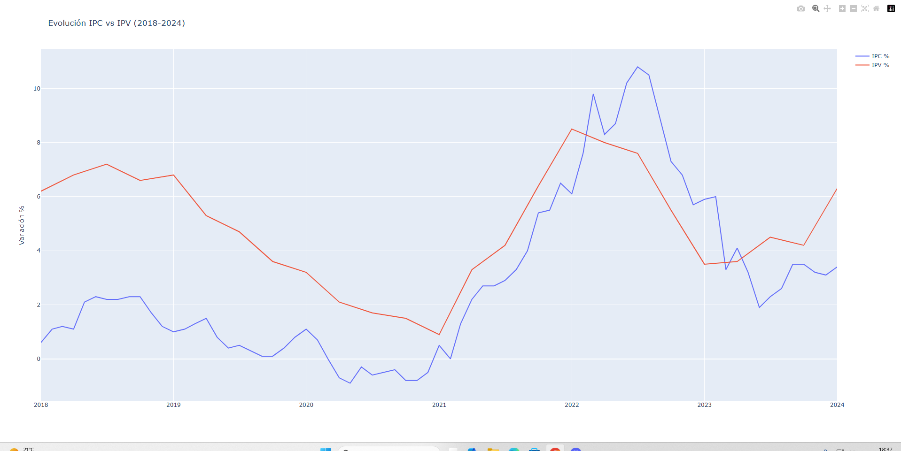
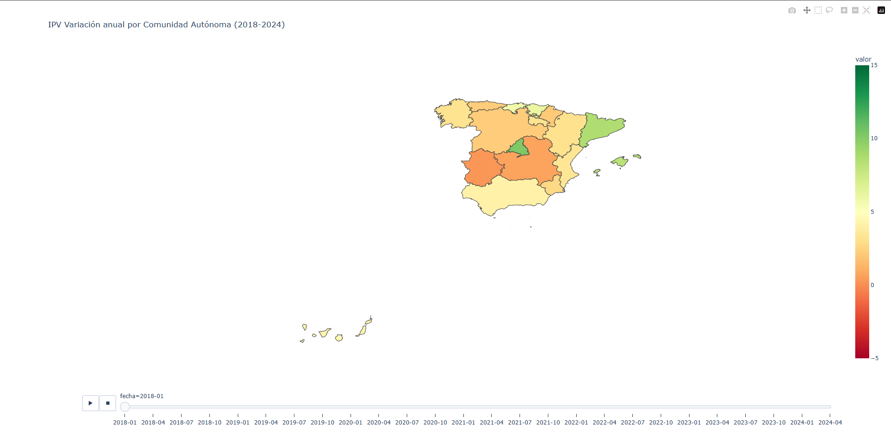
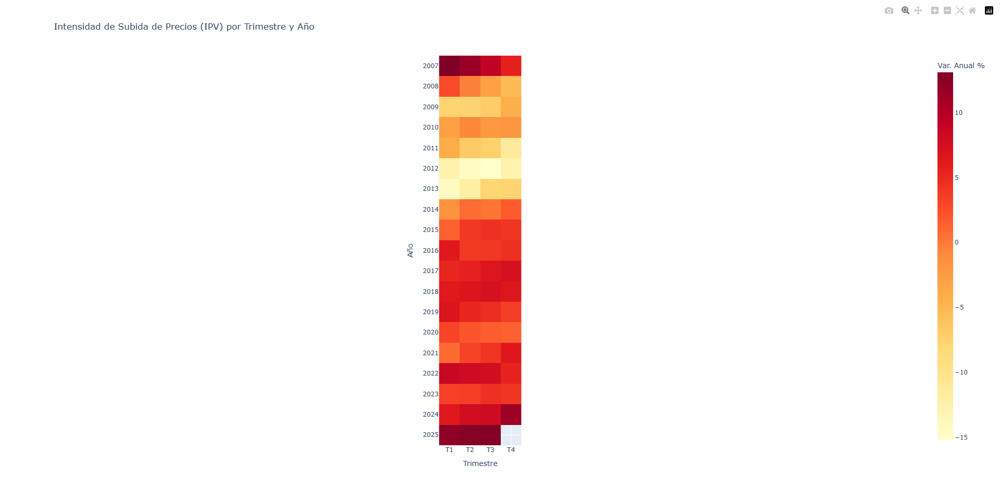
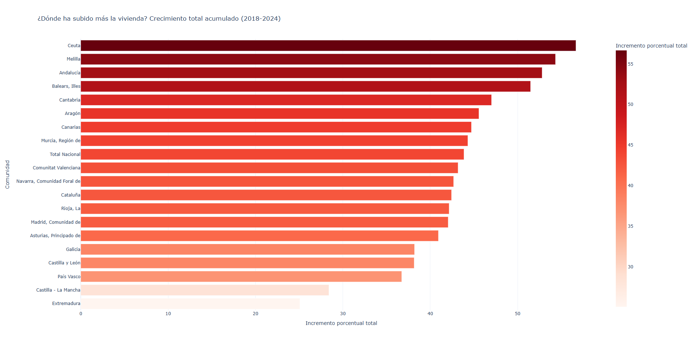
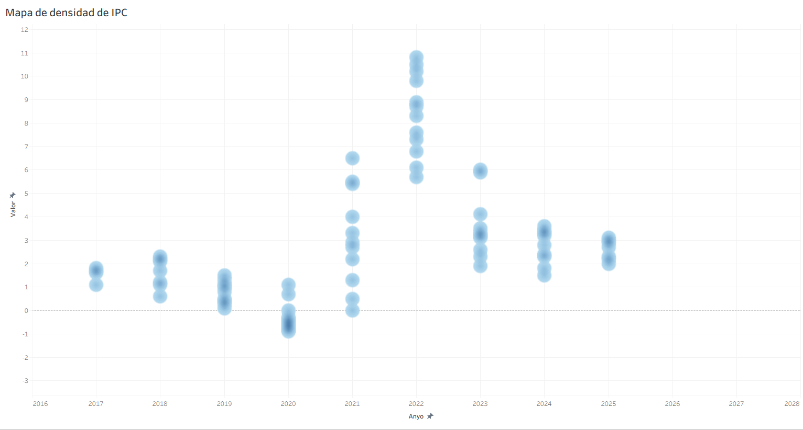

# 1. Actividad 1.7 - Proyecto de obtención y almacenamiento de datos

## 1.1.  Conexión con la base de datos.
En comparación con la práctica 1.7, esta vez hemos querido llevar el acceso de la base de datos fuera del entorno local, así simulando un situación real. Mediante el uso de un servidor proxmox y una mv
Debian, hemos alojado la base de datos utilizando MariaDB, y ssh en la conexión de la base de datos y un equipo (ambos en redes distintas - uso de ip pública y autenticación usuario/contraseña tanto en
el servidor como en MariaDB)
## 1.2. Extración y limpieza de los datos.
A partir de un Script desarrollado con el lenguaje Python, generamos una conexión ssh con el serviodor, y mediante querys guardamos todos los datos en DataFrames de la librería Polars. Una vez obtenido 
los datos, nos aseguramos de realizarle un "limpieza" para asegurarnos de que no existiera algún dato nulo, incorrecto o simplemente convertirlo en un dato más legible.
## 1.3. Creación de gráficos
Con la ayuda de Plotly, creamos algunos gráficos sobre temas relevantes a nuestros datos (IPV y IPC).

### Gráfico 1

Comparativa del IPC y IPV a lo largo de 2018 hasta 2024. Ambas presentan variaciones notables: la línea roja comienza en un valor medio, experimenta ligeras fluctuaciones, luego alcanza un pico pronunciado hacia la parte derecha antes de descender; mientras que la línea azul parece seguir una tendencia más irregular, con subidas y bajadas más marcadas, llegando también a valores altos en la zona final.

### Gráfico 2

Representación del ipv mediante la utilización de un mapa de españa, además del uso de colores explicando a lo largo de los años una situación más o menos favorable en las distintas comunidades.

### Gráfico 3

El heatmap muestra la evolución de la variación anual del Índice de Precios de la Vivienda (IPV) por trimestres entre 2007 y 2025, donde los colores representan la intensidad del cambio: tonos rojos indican fuertes subidas, mientras que los colores más claros reflejan crecimientos débiles o caídas. Se observa un periodo de gran crecimiento en 2007–2008, seguido de una fase prolongada de descenso o estancamiento entre 2009 y 2013. A partir de 2014, el mercado se recupera con aumentos sostenidos hasta 2019, mientras que en 2020 hay una ligera moderación. Posteriormente, destaca un nuevo repunte en 2021–2022 con incrementos intensos, seguido de cierta estabilización en 2023–2024, manteniéndose en niveles positivos.

### Gráfico 4

Este gráfico de barras muestra el crecimiento total acumulado del precio de la vivienda entre 2018 y 2024 por comunidades autónomas en España. Se observa una clara diferencia territorial, destacando Ceuta y Melilla como las zonas con mayor incremento, seguidas de regiones como Andalucía y Baleares, que también presentan subidas muy significativas. En un nivel intermedio se sitúan comunidades como Madrid, Cataluña y la Comunitat Valenciana, con crecimientos elevados pero más moderados. Por el contrario, regiones como Extremadura y Castilla-La Mancha registran los menores aumentos. En conjunto, el gráfico refleja un crecimiento generalizado del precio de la vivienda en todo el país, aunque con importantes desigualdades según la región.

# 2. Actividad 3.2 - Tableau

### Gráfico 1

Aquí se muestra la evolución y concentración de valores del IPC (inflación) por año entre 2017 y 2025 mediante un diagrama de densidad. Se observa que entre 2017 y 2019 los valores son relativamente bajos y estables, con poca variación, mientras que en 2020 incluso aparecen valores cercanos o por debajo de cero, indicando un periodo de muy baja inflación o ligera deflación. A partir de 2021 hay un aumento notable en la dispersión y el nivel del IPC, alcanzando su punto más alto en 2022, donde se concentran los valores más elevados (alrededor de 6 a más de 10), lo que refleja un pico inflacionario. Posteriormente, desde 2023 hasta 2025, los valores descienden y se estabilizan en niveles moderados (aproximadamente entre 2 y 4), lo que sugiere una normalización gradual de la inflación tras el aumento significativo de 2022.

### Gráfico 2

Esta gráfica compara la evolución del IPC (línea azul) y el IPV (línea roja) entre 2017 y 2025, mostrando cómo ambos indicadores se comportan a lo largo del tiempo. En los primeros años (2017–2019) ambos siguen una tendencia similar con valores moderados y cercanos, pero en 2020 caen a niveles bajos. A partir de 2021 se produce una divergencia clara: el IPV aumenta bruscamente, alcanzando su punto máximo en 2022 (casi 8), mientras que el IPC sube mucho menos y se mantiene relativamente contenido. Desde 2023 en adelante, ambos indicadores tienden a estabilizarse y acercarse nuevamente, situándose alrededor de valores entre 2.5 y 3 hacia 2024–2025. En conjunto, la gráfica sugiere que el IPV es más volátil y reacciona con mayor intensidad a cambios económicos, mientras que el IPC muestra una evolución más suave y gradual.

### Gráfico 3

Esta gráfica de barras apiladas muestra la evolución del valor total anual del IPV desde aproximadamente 2007 hasta 2025. Se observa una caída progresiva entre 2007 y 2013, alcanzando su punto más bajo en ese último año, lo que sugiere un periodo de contracción o menor actividad. A partir de 2014, comienza una recuperación sostenida, con incrementos graduales año tras año. Este crecimiento se vuelve más marcado desde 2021, hasta alcanzar su nivel más alto en 2025. Además, al ser barras apiladas, se aprecia cómo los distintos componentes que forman el IPV contribuyen al total, manteniendo una proporción relativamente estable a lo largo del tiempo. En conjunto, la gráfica refleja un ciclo claro: caída inicial, recuperación progresiva y expansión fuerte en los últimos años.
